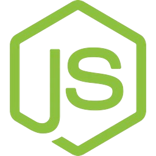

<div style="display:flex; align-items: center">
  
  <h1 style="position:relative; top: -6px" >quizwiz: The Quiz Bank SPA</h1>
</div>

---

quizwiz is an SPA designed to find and complete quizzes to test your knowledge and limitations.

#
### Table of Contents
* [Prerequisites](#prerequisites)
* [Tech Stack](#tech-stack)
* [Getting Started](#getting-started)
* [Development](#development)
* [API Documentation](#api-documentation)


#
### Prerequisites

* *node@20.11.0*
* *npm@10.2.4*

#
### Tech Stack

* **Vue.js V3**
* **Vue Router v4.3.0**
* **Vite v5.1.6**
* **Tailwind CSS v3.4.3**
* **Vee-Validate v4.12.6**


#
### Getting Started

1. Clone the repository
   ```sh
   git clone https://github.com/RedberryInternship/quizwiz-front-luka-trapaidze.git
   ```

2. Next step requires you to run *npm install* in order to install all the dependencies.
    ```sh
    npm install
    ```

3. And now you should provide **.env** file all the necessary environment variables:
   ####
   **API:**
   >VITE_BACKEND_URL=...
   
   after setting up **.env** file
   ##### you should be good to go!


#
### Development

You can now run the development server by executing:

```sh
npm run dev
```

#

### API Documentation

[API Documentation](https://documenter.getpostman.com/view/33136231/2sA3BuVoDa#5476b041-b8fd-4766-abd8-91d09c76dd45 "Postman")